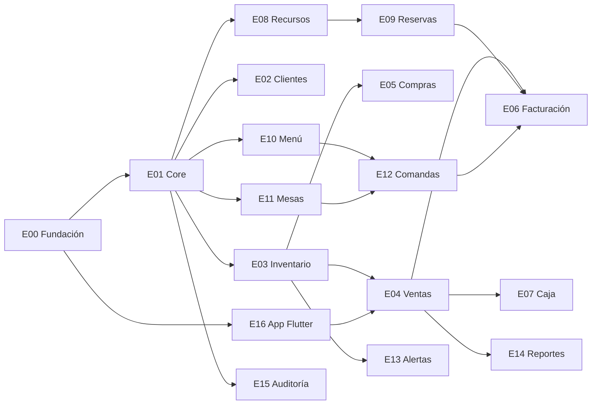

# Tablero de ejecución

El orden no es una preferencia: respeta las dependencias reales entre módulos. Un módulo no se
empieza hasta que sus dependencias existen **y están probadas**.

---

## Hito 1 · Fundación

Los dos repos, las bases, el CI y los mecanismos transversales. Nada de negocio todavía, pero sin esto lo demás se hace mal.

**10 historias · 49 puntos · acumulado 49**

| Épica | Nombre | HU | Puntos |
|---|---|---:|---:|
| `E00` | Fundación | 10 | 49 |

Historias del hito

- `HU-001` Scaffolding del monorepo de backend
- `HU-002` Scaffolding del monorepo Flutter con melos
- `HU-003` Levantar el entorno local con Docker Compose
- `HU-004` Crear una base de datos por microservicio
- `HU-005` Migraciones versionadas con Flyway por servicio
- `HU-006` Row-Level Security activa en todas las tablas de negocio
- `HU-007` API Gateway con validación de JWT y enrutamiento
- `HU-008` Outbox e Inbox como librería compartida
- `HU-009` Pipeline de CI para ambos repos
- `HU-010` Documentación OpenAPI por servicio

---

## Hito 2 · Núcleo operable

Un negocio puede darse de alta, entrar y administrar sus usuarios. La app arranca y navega.

**17 historias · 81 puntos · acumulado 130**

| Épica | Nombre | HU | Puntos |
|---|---|---:|---:|
| `E01` | Core · Tenant e identidad | 10 | 42 |
| `E16` | App Flutter · núcleo | 7 | 39 |

Historias del hito

- `HU-011` Registrar un negocio nuevo con su plan y patrón
- `HU-012` Crear el primer usuario administrador del negocio
- `HU-013` Autenticación con emisión de JWT
- `HU-014` Rotación y revocación de refresh tokens
- `HU-015` Gestión de usuarios del negocio con límite por plan
- `HU-016` Motor de roles y permisos por negocio
- `HU-017` Validación de módulo por plan en el backend
- `HU-018` Configuración fiscal y de operación del negocio
- `HU-019` Sucursales y bodegas del negocio
- `HU-020` Consulta del plan y los módulos activos desde la app
- `HU-106` Tema y sistema de diseño en código
- `HU-107` Navegación con rutas protegidas por rol y módulo
- `HU-108` Composición adaptativa entre móvil y escritorio
- `HU-109` Sesión, token seguro y refresco automático
- `HU-110` Base de datos local con Drift en Android y Web
- `HU-111` Cola de sincronización en segundo plano
- `HU-112` Cliente HTTP con manejo uniforme de errores

---

## Hito 3 · MVP vendible · Venta directa

Una ferretería puede operar de verdad: catálogo configurable, stock, POS y factura electrónica.

**34 historias · 210 puntos · acumulado 340**

| Épica | Nombre | HU | Puntos |
|---|---|---:|---:|
| `E03` | Inventario · catálogo del patrón Venta directa | 11 | 65 |
| `E04` | Ventas · transacción del patrón Venta directa | 11 | 68 |
| `E02` | Clientes y cartera | 5 | 20 |
| `E06` | Facturación electrónica DIAN | 7 | 57 |

Historias del hito

- `HU-026` Categorías del negocio con jerarquía
- `HU-027` Definir los atributos que exige cada categoría
- `HU-028` Crear producto con validación de atributos dinámicos
- `HU-029` Bodegas y existencias por producto y bodega
- `HU-030` Libro mayor de movimientos de inventario
- `HU-031` Lotes y fechas de vencimiento
- `HU-032` Traslados entre bodegas
- `HU-033` Ajustes de inventario con motivo
- `HU-034` Reserva y liberación de stock para la saga de ventas
- `HU-035` Búsqueda de productos y escaneo de código de barras
- `HU-036` Listas de precios y precios por volumen
- `HU-037` Crear una venta en borrador con sus líneas
- `HU-038` Saga de confirmación de venta con reserva de stock
- `HU-039` Registrar el pago de una venta, incluso mixto
- `HU-040` Venta a crédito con validación de cupo
- `HU-041` Anular una venta con reintegro de stock
- `HU-042` Devoluciones totales y parciales
- `HU-043` Sincronización de ventas creadas sin conexión
- `HU-044` Cotizaciones que se convierten en venta
- `HU-045` Pantalla de POS en móvil y en web
- `HU-113` Asignar un cliente a la venta
- `HU-114` Crear un cliente desde la venta, sin salir de la pantalla
- `HU-021` Crear y consultar clientes
- `HU-022` Cupo de crédito y cartera del cliente
- `HU-023` Métricas del cliente alimentadas por eventos
- `HU-024` Historial de interacciones con el cliente
- `HU-025` Listado de clientes en móvil con búsqueda y filtros
- `HU-052` Administrar resoluciones de numeración DIAN
- `HU-053` Emitir factura desde cualquiera de los tres patrones
- `HU-054` Asignación del consecutivo dentro del rango autorizado
- `HU-055` Firma digital y transmisión a la DIAN
- `HU-056` Notas crédito
- `HU-057` Modo de contingencia cuando la DIAN no responde
- `HU-058` Consulta y envío de facturas al cliente

---

## Hito 4 · Negocio completo en Venta directa

Compras, caja y los reportes que hacen que el dueño abra la app todos los días.

**20 historias · 110 puntos · acumulado 450**

| Épica | Nombre | HU | Puntos |
|---|---|---:|---:|
| `E05` | Compras y proveedores | 6 | 31 |
| `E07` | Caja y POS | 5 | 19 |
| `E13` | Alertas y notificaciones | 4 | 21 |
| `E14` | Reportes y dashboards | 5 | 39 |

Historias del hito

- `HU-046` Administrar proveedores
- `HU-047` Órdenes de compra con aprobación
- `HU-048` Recepción de mercancía con captura de lotes
- `HU-049` Cuentas por pagar y pagos a proveedores
- `HU-050` Sugerencia de compra a partir de stock bajo mínimo
- `HU-051` Recepción desde el celular en la bodega
- `HU-059` Abrir y cerrar sesión de caja
- `HU-060` Movimientos de caja desde los tres patrones
- `HU-061` Ingresos, retiros y gastos de caja
- `HU-062` Arqueo por denominaciones
- `HU-063` Reporte de cierre de caja
- `HU-092` Motor de reglas de alerta configurable
- `HU-093` Alertas de inventario: stock bajo y lotes por vencer
- `HU-094` Entrega por push, correo y dentro de la app
- `HU-095` Centro de alertas en la app
- `HU-096` Esquema en estrella alimentado por eventos
- `HU-097` Agregados diarios para el dashboard
- `HU-098` Reportes de ventas, márgenes y rotación
- `HU-099` Métricas propias de Reserva y de Comanda
- `HU-100` Exportar y programar reportes

---

## Hito 5 · Segundo patrón · Reserva

Un hotel opera sin tocar nada de lo anterior.

**12 historias · 79 puntos · acumulado 529**

| Épica | Nombre | HU | Puntos |
|---|---|---:|---:|
| `E08` | Recursos · catálogo del patrón Reserva | 5 | 24 |
| `E09` | Reservas · transacción del patrón Reserva | 7 | 55 |

Historias del hito

- `HU-064` Tipos de recurso con atributos configurables
- `HU-065` Administrar recursos individuales
- `HU-066` Tarifas por temporada, día y franja con prioridad
- `HU-067` Bloqueos de recurso por mantenimiento
- `HU-068` Servicios adicionales y políticas de cancelación
- `HU-069` Consultar disponibilidad en un periodo
- `HU-070` Crear una reserva sin posibilidad de overbooking
- `HU-071` Confirmar, cancelar y marcar no-show
- `HU-072` Check-in con asignación de recurso
- `HU-073` Cargar consumos a la estancia
- `HU-074` Check-out, liquidación y cierre de estancia
- `HU-075` Calendario visual de ocupación

---

## Hito 6 · Tercer patrón · Comanda

Un restaurante opera, con cocina e inventario conectados.

**16 historias · 92 puntos · acumulado 621**

| Épica | Nombre | HU | Puntos |
|---|---|---:|---:|
| `E10` | Menú · catálogo del patrón Comanda | 5 | 24 |
| `E11` | Mesas · el salón | 4 | 18 |
| `E12` | Comandas · transacción del patrón Comanda | 7 | 50 |

Historias del hito

- `HU-076` Cartas y categorías de menú por horario
- `HU-077` Ítems de menú con estación de cocina
- `HU-078` Modificadores con mínimos y máximos
- `HU-079` Recetas: el puente entre la comanda y el inventario
- `HU-080` Disponibilidad diaria de ítems
- `HU-081` Zonas y mesas con su posición en el plano
- `HU-082` Sesión de mesa: abrir, ocupar y liberar
- `HU-083` Unir mesas para un grupo grande
- `HU-084` Plano del salón en tiempo real
- `HU-085` Abrir comanda y agregar líneas mientras el servicio avanza
- `HU-086` Ciclo de vida propio de cada línea
- `HU-087` Anular una línea: antes y después de enviarla a cocina
- `HU-088` Enviar a cocina y pantalla KDS por estación
- `HU-089` Dividir la cuenta entre comensales
- `HU-090` Cerrar la comanda con propina y descuento de insumos
- `HU-091` Toma de comanda desde el celular del mesero

---

## Hito 7 · Escala

Multi-sucursal, auditoría y sincronización para el plan Empresarial.

**5 historias · 32 puntos · acumulado 653**

| Épica | Nombre | HU | Puntos |
|---|---|---:|---:|
| `E15` | Auditoría y sincronización | 5 | 32 |

Historias del hito

- `HU-101` Bitácora de auditoría append-only
- `HU-102` Cola de sincronización de operaciones offline
- `HU-103` Detección y resolución de conflictos de sincronización
- `HU-104` Descarga incremental de cambios del servidor
- `HU-105` Consulta de auditoría desde la app

---

## Las diez historias que no se pueden hacer mal

Si alguna de estas queda mal implementada, el problema no se arregla después sin reescribir.

| ID | Historia | Por qué |
|---|---|---|
| `HU-006` | Row-Level Security activa en todas las tablas de negocio | Un `SET` en vez de `SET LOCAL` convierte el mecanismo de seguridad en una fuga entre clientes. |
| `HU-008` | Outbox e Inbox como librería compartida | Sin esto los eventos se pierden en silencio o se procesan dos veces. |
| `HU-027` | Definir los atributos que exige cada categoría | Es lo que hace que un tipo de negocio nuevo no requiera código. |
| `HU-029` | Bodegas y existencias por producto y bodega | Mover el stock a otra tabla después obliga a reescribir todas las consultas de venta. |
| `HU-030` | Libro mayor de movimientos de inventario | Es la única forma de explicar un descuadre sin adivinar. |
| `HU-034` | Reserva y liberación de stock para la saga de ventas | Sin la expiración, una venta abandonada bloquea stock para siempre. |
| `HU-038` | Saga de confirmación de venta con reserva de stock | Es lo que reemplaza al `@Transactional` que no existe entre servicios. |
| `HU-043` | Sincronización de ventas creadas sin conexión | Define por qué toda PK es UUID. Cambiarlo después es rehacer el modelo. |
| `HU-054` | Asignación del consecutivo dentro del rango autorizado | Un hueco en la numeración es un problema legal, no un bug. |
| `HU-070` | Crear una reserva sin posibilidad de overbooking | Validarlo en Java deja una ventana de carrera que vende dos veces la misma habitación. |
| `HU-079` | Recetas: el puente entre la comanda y el inventario | Sin esto el patrón Comanda nunca toca el inventario. |
| `HU-087` | Anular una línea: antes y después de enviarla a cocina | Anular después de cocinar es merma; antes, no. Confundirlas descuadra el inventario. |

## Grafo de dependencias

Solo las dependencias entre épicas; el detalle por historia está en cada archivo.

